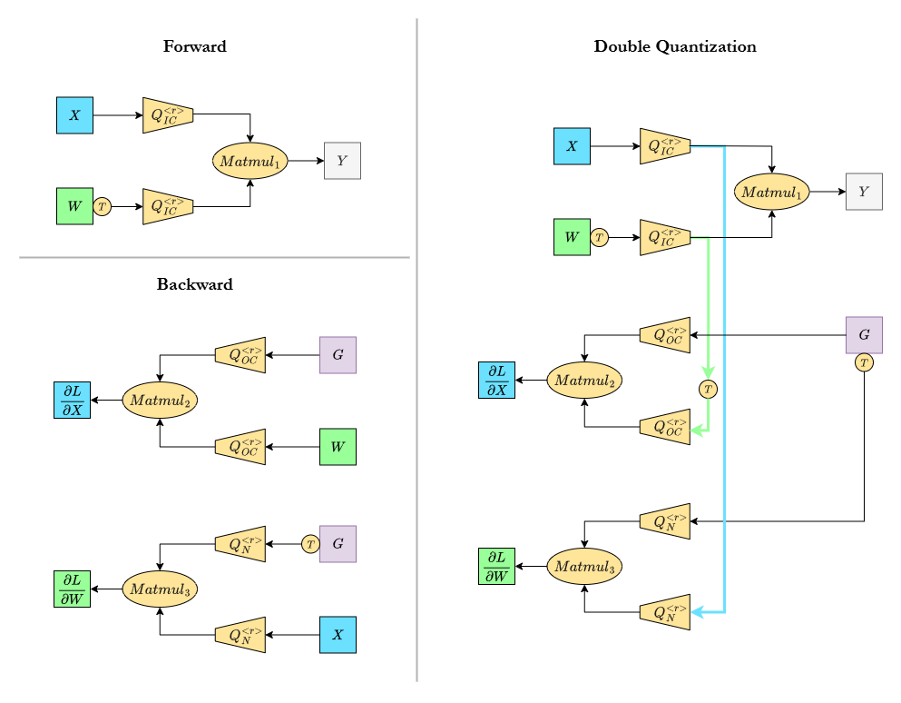
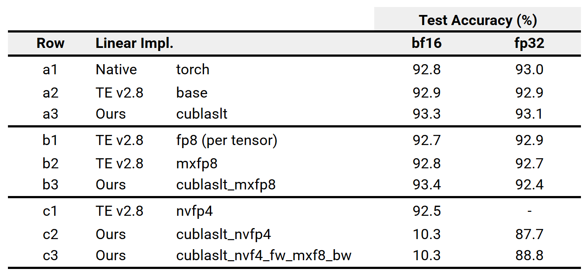

## Quantized Training in FP4(8)
*Concepts and Reference Pytorch Implementation using [cuBLASLt][doc_cublaslt] and [Microxcaling][ghmsmx].*

Narrow-precision training is rapidly becoming mainstream. This repo offers a concise technical walkthrough and reference implementation targeting modern hardware (e.g., Blackwell B200). The goal is to help practitioners understand and customize low-precision layer end-to-end, not just run a black-box recipe.

Jump to:
- [Hit the Ground Running](#hit-the-ground-running)
- [Training Results on TinyViT/MNIST](#training-results-on-tinyvitmnist)
- [Coding Guide on using cuBLASlt and Microxcaling](#coding-guide)
- [The Three GEMMs of Training](#the-three-gemms-of-training)
- [1D Block Quantization, Microscaling (MX) Format and NVFP4](#1d-block-quantization-mx-format-and-nvfp4)
- [Varying Axis of Quantization](#varying-axis-of-quantization)
- [Recent Trends in FP4 Training Research](#recent-trends-in-fp4-training-research)
- [Future Plan](#future-plan)
- [Further Reading and References](#references)

---
### The Three GEMMs of Training
*Trilogy behind FP4/FP8 speedups*

The premise of low precision training is the "*Speedups*" by mapping the heavy math in fewer bit representation where corresponding hardware runs faster. On FP4-supported HW, e.g. [Nvidia Blackwell (B200)](https://nvdam.widen.net/s/wwnsxrhm2w/blackwell-datasheet-3384703) and [AMD CDNA 4 (MI350X)](https://www.amd.com/content/dam/amd/en/documents/instinct-tech-docs/product-briefs/amd-instinct-mi350x-platform-brochure.pdf), **FP4** matmul peak throughput is about **2× of FP8**, **4× over FP/BF16**.

Most modern models are Transformers. The main workhorses are linear projections and attentions which are fundamentally matrix multiplications (matmuls). If we can execute these matmuls on the new FP4/FP8 units, we get speedups in training (inference too). In linear algebra libraries these matmuls are often referred to as GEMMs, short for GEneral Matrix-Matrix Multiplications.

However, not all operations in a Transformer can be safely pushed to low precision. Numerical stability and training convergence constrain  optimizers, normalization, softmax, and other sensitive components to remain in higher precision. As a result, most research and practical systems focus on linear layers first, as they dominate training compute and tend to better "absorb" quantization effects.

We now walk through the three matmuls that form the *"trilogy"* of linear-layer training, and how quantization applies to each. A diagram follows to illustrate the discussion. 

* **MatMul 1** for computing forward pass of linear layer:
   
   &emsp; $Y = X W^{T}$ &emsp; where input $X$ is $(N, IC)$, weights $W$ is $(OC, IC)$ following `torch` layout, and output $Y$ is $(N, OC)$. For brevity, Transformer's batch size and sequence length are collapsed into $N$.

* **MatMul 2** in the backward pass for computing **gradient w.r.t. inputs** :

   &emsp; $\frac{\partial L}{\partial X} = \frac{\partial L}{\partial Y}\frac{\partial Y}{\partial X} =GW$ &emsp; where $G = \frac{\partial L}{\partial Y}$, is $(N, OC)$, the backprop incoming gradient. $\frac{\partial L}{\partial X}$ has shape of $(N, IC)$ 

* **MatMul 3** in the backward pass for computing **gradient w.r.t. weights**:

   &emsp; $\frac{\partial L}{\partial W} = \frac{\partial L}{\partial Y}\frac{\partial Y}{\partial W} =G^{T}X$ &emsp; where $\frac{\partial L}{\partial W}$ has the same shape as $W$, $(OC, IC)$


Essentially, $X, W, G$ must be quantized to target precision (FP8/4) before we feed them to the matrix engines. Notice the quantization operators in diagram above. The quantization used in training today generally follows the form below (technically  known as symmetric quantization). Given a matrix $M$, quantization produces a quantized matrix $Q_M$ and a scale $s_M$:

&emsp; $Q_M = \mathrm{round}(M / s_M)$ &emsp; where &ensp; $s_M = \frac{\max(|M|)}{q_{\max}}$

Here, $q_{\max}$ denotes the maximum representable magnitude in the target precision. $s_M$ is a *scalar* scaler 🎯😁.

Now consider a matrix multiplication $A@B$, we quantize $A$ and $B$ into $Q_{A}, Q_{B}$ with scales $s_{A}, s_{B}$ respectively. The low-precision matmul becomes:

&emsp; $A@B \approx s_A \cdot Q_A @ s_B \cdot Q_B = (s_A \cdot s_B)(Q_A @ Q_B)$

The execution above is hardware-accelerated, output of low-precision matmul $Q_{A} @ Q_{B}$ results will be mapped (*dequantized*) to the original high-precision using $s_A, s_B$.

### 1D Block Quantization, MX Format and NVFP4

Quantization introduces distortion, which can cause training divergence if not properly managed. A key lever for minimizing distortion is granularity. Granularity refers to how to group the elements within a matrix such that each group is quantized independently with its own scale. Smaller groups tends to bound the dynamic range, which effectively increases representable precision in low-bit formats, thereby reducing quantization error. In principle, grouping size can take arbitrary shapes. A matrix can be quantized with:
* One scale for the whole matrix (per-tensor)
* One scale per row or per column
* One scale per block (block / group quantization), e.g. 4×4, 8×32, 1×16, etc.

A frontier example is [DeepSeek-V3][dsv3], which trains in FP8 using 128×128 weight blocks and 1×128 activation blocks, a configuration that is friendly to Hopper architecture and helps mitigate the sensitivity to outliers in per-tensor quantization.

Pushing narrower precision demands finer granularity. Varying choices among hardware vendor would be a nightmare for model portability and interoperability. **Microscaling Formats (MX)**, a specification from the Open Compute Project (OCP), aims to prevent such fragmentation by establishing a common low-precision representation for vendors and model providers. At its core, **MX defines** a 1D block size of 32 elements, along with the encoding format for the scale (8-bit exponent) and quantized values (FP4/FP6/FP8, including ExMy, NaN/Inf/subnormal). MXFP4/6/8 denote MX-compliant formats. See the [OCP MX spec][ocp_mx] for details.

As of Q3/Q4 2025, on top of MXFP8/6/4, Nvidia Blackwell also supports [NVFP4][blog_nvfp4_i]. The key differences are that **NVFP4** uses 16-element blocks instead of 32 and employs an FP8 scale instead of an 8-bit exponent. We will experiment with MXFP8 and NVFP4 in our cuBLASLt-based implementation later.

| Format   | Block Size | Scale Type | Value Type           |
|----------|:----------:|:----------:|----------------------|
| MXFP8    | 32         | E8M0       | FP8: E5M2 / E4M3     |
| MXFP6    | 32         | E8M0       | FP6: E3M2 / E2M3     |
| MXFP4    | 32         | E8M0       | FP4: E2M1            |
| NVFP4    | 16         | FP8 (E4M3) | FP4: E2M1            |

> ExMy has a leading sign bit except E8M0. MXINT8 is also defined in the MX spec.

### Varying Axis of Quantization

"1D" block quantization means the blocks are taken along **one** of the matrix axes, even though the physical grouping is still 2D. For example, MX groups contiguous 32 elements along a row or a column (NVFP4 uses 16 elements), so the block shape is effectively 1×K or K×1 where K is the block (group) size.

This raises a key question: along which axis should we quantize? **Along the contraction (inner) axis of the matmul.**

If you inspect the three training GEMMs closely, each $W, X, G$ must be quantized along different axes depending on the matmul. As a result, the same tensor requires both axes of quantization. In the diagram above, we normalize everything to row-wise quantization and insert transposes to match our equations. In practice, implementations choose how to handle this. For example:
1. [Transformer Engine][te] keeps both row-wise and column-wise quantized copies to avoid transposes at runtime.
2. Some work uses double quantization (as shown on the right of the diagram), i.e., re-quantizing an already (de)quantized tensor along the other axis. This avoids storing two copies, at the cost of additional quantization error.

That's it! These are the key concepts behind low-precision training on state-of-the-art hardware today. Next, we will implement a custom PyTorch Linear module that performs the trio of GEMMs using cuBLASLt with official MX quantization.

---
### Hit the Ground Running

Setup: Use the prebuilt Docker image on a B200 GPU. Other Blackwell cards (e.g., RTX 50-series and PRO 6000) are not supported, because [Transformer Engine][te] we use for comparison is not enabled on them yet.
```
docker run -it --gpus all vuiseng9/fp4-training
```
If you'd like to customize, refer `docker/Dockerfile`. Note: building Transformer Engine from source is non-trivial, if you do, start from an Nvidia Docker image. However, if you only want to build and run our implementation, CUDA Toolkit >= 12.9 and a compatible Pytorch is sufficient (no TE required).

**What to run?**
We provide two scripts that demonstrate quantized training via different `Linear` implementations:
1. Our custom MXFP8 / NVFP4 path via [cuBLASLt][doc_cublaslt] + [Microxcaling][ghmxfork]
2. Nvidia's [Transformer Engine][te] recipe for comparison

Both scripts train a tiny ViT (single Transformer block) on MNIST. See [Coding Guide](#coding-guide) for walkthrough of our implementation and training quality comparison right after this section.

```bash
# (1) Our custom cuBLASLt + Microxcaling backend
python main_train_tinyvit_mnist.py 
   --impl torch             # out-of-the-box pytorch baseline 
   --impl custom_py         # inherited linear to illustrate the 3 gemms and template for custom kernel
   --impl custom_aten       # custom cpp-cuda backend using aten addmm/mm  
   --impl cublaslt          # custom cpp-cuda backend using cublaslt for bf16 / fp32 matmul
   --impl cublaslt_mxfp8    # mxfp8 via microxcaling + cublaslt mxfp8 matmul
   --impl cublaslt_nvfp4    # nvfp4 via microxcaling + cublaslt nvfp4 matmul
   --impl cublaslt_nvf4_fw_mxf8_bw # nvfp4 forward + mxfp8 backward
   -h # see options, default: batch size 64, 3 epoch, lr 1e-3

# Notes:
# All of the above are using bf16 as main compute 
#  via torch.autocast as the standard baseline precision today.
# i.e. Input and weight of linear are dynamically cast to bf16 in forward pass, 
#  the quantization is from bf16 to the target low precision.
# We also support fp32, just add --fp32
```

```bash
# (2) Transformer Engine (TE)
python main_te_train_tinyvit_mnist.py 
   --recipe base      # TE Linear layer, trainable with torch.autocast
   --recipe fp8       # Float8CurrentScaling recipe (per-tensor fp8)
   --recipe mxfp8     # MXFP8BlockScaling recipe
   --recipe nvfp4     # NVFP4BlockScaling recipe
   -h # see options, default: batch size 64, 3 epoch, lr 1e-3
   # similarly just add --fp32 for main compute in full precision
```

**Verifying matmul precision through cuBLASLT logging:**
```bash
export CUBLASLT_LOG_LEVEL=2
export CUBLASLT_LOG_FILE=./log.cublaslt # optional. If not set, 
# cublaslt logs to stdout, harder to see training progress.
```
Example log lines: 
* `A/Bdesc` reports details of input matrices A, B (`R_8F_E4M3`, `R_4F_E2M1`), `Ddesc` for matmul output (`R_16BF`, `R_32F`).
* Layout transpose: `transa=OP_T` or `transb=OP_T`, no report means no transpose.
* MX or NV blocking? `aScaleMode=VEC32_UE8M0 bScaleMode=VEC32_UE8M0` vs  `aScaleMode=VEC16_UE4M3 bScaleMode=VEC16_UE4M3`
* `computeType=COMPUTE_32F` is expected for mxfp8/nvfp4 matmuls as they are accumulated to f32 internally.
```bash
# mxfp8
[2025-11-03 19:02:38][cublasLt][557785][Trace][cublasLtMatmul] A=0X736CB315E800 
Adesc=[type=R_8F_E4M3 rows=64 cols=1088 ld=64] B=0X736C9B644000 
Bdesc=[type=R_8F_E4M3 rows=128 cols=1088 ld=128] C=0X0 
Cdesc=[type=R_16BF rows=64 cols=128 ld=64] D=0X736CB30A4400 
Ddesc=[type=R_16BF rows=64 cols=128 ld=64] 
computeDesc=[computeType=COMPUTE_32F scaleType=R_32F transb=OP_T 
aScalePointer=0x736cb30b4c00 bScalePointer=0x736cb30ba200 
aScaleMode=VEC32_UE8M0 bScaleMode=VEC32_UE8M0] 
algo=[algoId=66 tile=MATMUL_TILE_128x128 
stages=MATMUL_STAGES_128xAUTO customOption=3 clusterShape=CLUSTER_SHAPE_1x1x1] 
workSpace=0X0 workSpaceSizeInBytes=0 beta=0 outOfPlace=1 stream=0X0

# nvfp4
[2025-11-03 19:07:51][cublasLt][570888][Trace][cublasLtMatmul] A=0X75056B1F7000 
Adesc=[type=R_4F_E2M1 rows=1088 cols=64 ld=1088] B=0X75051DFCDE00 
Bdesc=[type=R_4F_E2M1 rows=1088 cols=64 ld=1088] C=0X0 
Cdesc=[type=R_32F rows=64 cols=64 ld=64] D=0X75051D9F8A00 
Ddesc=[type=R_32F rows=64 cols=64 ld=64] 
computeDesc=[computeType=COMPUTE_32F scaleType=R_32F transa=OP_T 
aScalePointer=0x75051d9da400 bScalePointer=0x75051dfbaa00 
aScaleMode=VEC16_UE4M3 bScaleMode=VEC16_UE4M3] 
algo=[algoId=70 tile=MATMUL_TILE_128x128 
stages=MATMUL_STAGES_256xAUTO clusterShape=CLUSTER_SHAPE_2x1x1 schedulingMode=0] 
workSpace=0X0 workSpaceSizeInBytes=0 beta=0 outOfPlace=1 stream=0X0
```

**Debuggability**: `vscode/launch.json` provided for breaking at Python & C++ codes. `tests` are included to validate linear correctness.

---
### Training Results on TinyViT/MNIST



The results are averaged over 5 runs. Use `run_all.sh` to reproduce. Note that PyTorch, Transformer Engine (TE) and our implementation are all backed by cuBLASLt, the labels in the table mean to correspond our scripts [above](#hit-the-ground-running-🚀).

**Set a** compares linear layer trained with PyTorch autocast BF16, FP32, with no quantization involved, serving the baseline training quality. TE's base variant uses its own subclassed torch.nn.Linear with autocast enabled as well. As expected, all variants converge similarly to the native PyTorch baseline; our implementation shows a slightly higher accuracy, which we don't over-interpret. The primary focus here is low-precision training.

**Set b** begins with TE's per-tensor FP8 recipe. As we don't include a per-tensor FP8 variant in our implementation, b1 is shown mainly for reference, as it's trivial to enable with TE. The accuracy drop from baseline is negligible. Moving to TE's MXFP8, results are nearly identical. In principle, MXFP8 should outperform per-tensor quantization due to finer granularity, but on this small model and dataset the difference is minimal. Our MXFP8 Linear achieves slightly higher accuracy in BF16 runs and marginally lower in FP32. We suspect this small variance arises from differences in scale computation, as discussed in several prior works and we discussed further in the [research](#recent-trends-in-fp4-training-research) section. Nevertheless, MXFP8 training proves viable even on a low-capacity model like TinyViT.

**Set c** presents the key result of 4-bit training. TE's NVFP4 recipe achieves accuracy nearly matching its higher-precision counterparts, though slightly lower. FP32 runs are unavailable due to a required operator lacking FP32 support. In contrast, our NVFP4 Linear becomes untrainable in BF16 runs. There are a few reasons for this. The strong performance of TE's NVFP4 comes from its sophisticated mixed-precision strategy, which we have not yet integrated:
(1) a per-tensor FP32 scale applied on top of the E4M3 scale to extend dynamic range ([Figure 2][blog_nvfp4_i]),
(2) stochastic rounding to reduce bias, and
(3) rotation-based transform to mitigate outliers.
We discuss (2) and (3) further in the [research](#recent-trends-in-fp4-training-research) section. Despite lacking these components, when we fall back to FP32, our NVFP4 Linear trains up to 87.7% (C2), and when combined with MXFP8 backward (C3), it gains roughly one percentage point more. We plan to incorporate (1) in near future.

**Training speedup** is not reported, as our current implementation is slower, not due to cuBLASLt, but primarily because of the quantizer. We use Microxcaling, implemented in pure PyTorch and not optimized for performance. The main intent is to help users debug and understand the low-precision training flow without the complexity of low-level code. That said, adding a CUDA-based quantization kernel is part of our planned next steps.

If you're curious about FP4 performance gains, we benchmarked Transformer Engine [here][myperf] with Llama3-8B pretraining on 8× B200 GPUs. NVFP4 achieves ~1.25× speedup over MXFP8 and ~1.65× over BF16.

---
### Coding Guide

To experiment with FP8/FP4 training, the main component we customize is the Linear layer. This requires 3 pieces to work together:
(1) cuBLASLt, to drive the hardware-accelerated low-precision GEMMs,
(2) quantization, where we rely on the official Microxcaling library (forked for customization), and
(3) a minimal model + training loop to validate correctness and training quality. We use TinyViT on MNIST as our testbed. TinyGPT coming soon.

The goal of this walkthrough is not to overwhelm you with implementation details, but to give you a structured path through the code. Follow the recommended file order below to see how the components compose, from pure PyTorch ops, to ATen CUDA calls, to quantizer/swizzler and finally to cuBLASLt MX/NV matmuls. The code is commented in an incremental manner; read it in order, and if something feels unclear, trace backward through the earlier steps.

Recommended steps and notes:
* `main_train_tinyvit_mnist.py`: Entry point to train TinyViT on MNIST using various `Linear` implementations. Check `--impl` argument to switch between different backends. 

* `models/{vit.py,transformer_block.py}`: TinyViT model definition with a single Transformer block.

* `custom.py` subclasses `torch.nn.Linear` and use a custom `torch.autograd.Function` to implement the linear operator using native ops for clear illustration of the 3 GEMMs (no quantization yet) and as a template for custom kernels.

* `xops.cpp, aten_mm.cpp` introduce a custom C++/CUDA extension that calls `at::addmm/mm`, `cuda_aten.py` demonstrates how to wrap custom CUDA code in PyTorch and integrate it as a module.

* `cublaslt.py` and `cublaslt_mm_fp32bf16.cu`: First step toward cuBLASLt integration, implementing BF16/FP32 matmul. Worth reviewing the CUDA code to see how matmul/compute descriptors are set up and cuBLASLt APIs are launched. Reasonably involved, keep the official docs [handy][doc_cublaslt].

* `quantize.py`: Before using low-precision matmul, we quantize inputs using Microxcaling. Our fork is included as a submodule in this repo. We customize behavior and propagate MX formats downstream for packing/swizzling. Focus `q_mxfp8_rowwise, q_mxfp8_colwise, q_nvfp4_rowwise`. 

* `swizzle.py`: [Layout][swzlayout] transformation of quantization scales for the access patterns required by matmul engine.

* `mxfp8.py` and `cublaslt_mm_mxfp8.cu`: the custom MXFP8 Linear, see how all the pieces come together: quantization (especially blocking axis and configuration), swizzling, cuBLASLt matmul. Good to find out what additional configurations are needed for MXFP8 matmul in cuBLASLt.

* `mxfp8.py` and `cublaslt_mm_nvfp4.cu`: similar to MXFP8 but for NVFP4. Note the different blocking size (16 vs 32) and scale type (FP8 vs E8M0). Also how to pack 2xFP4 values into 1 byte for cuBLASLt.

* `nvf4fwd_mxf8bwd.py`: Implements a hybrid Linear layer with NVFP4 forward and MXFP8 backward using the lower level ops above.

#### TN, NN, NT Layout

This is basically about whether to transpose A and B in cuBLASLt, and how the three GEMMs map to each case. We won't derive the full mapping here, take it as an exercise if you're unfamiliar, but pay attention to these details:

1. PyTorch tensors are row-major; cuBLASLt supports both layouts but defaults to col-major.
1. The Linear weight in PyTorch is stored as (OC, IC) in row-major order.
1. cuBLASLt follows the form `D = α·op(A) @ op(B) + β·C`, with an optional epilogue `(ϕ(D))`. Use epilogue to implement bias instead of the C term.
1. Duality of matrix view: row-major X ≡ col-major Xᵀ. 

---
### Recent Trends in FP4 Training Research

Quantization has long been mainstream for inference (e.g., Post-Training Quantization and Quantization-Aware Training).
However, training in FP4/FP8 has only gained momentum in the last 1–2 years, with several notable research works emerging in 2025. Below are some of the key themes shaping this space.

1. Stochastic Rounding (SR)

   The rounding mode determines how scaled values are rounded to the nearest representable quantized levels, see the `round()` term in our earlier formula. Typically (or naively), *round-to-nearest* is used. This has been found to introduce quantization bias and can destabilize gradient descent. Numerous studies have shown that *randomly* rounding up or down alleviates this issue and is now widely regarded as an essential component in stable low-precision training. Paper A-E adopt SR and confirm its effectiveness. Paper B has theoretically arrived that when the gradient magnitude of a parameter falls below √3×quantization noise, SR's benefit vanishes, proposing last-mile fine-tuning in higher precision, meaning QAT at last phase.

2. Rotation-based Transform Prior to Quantization

   Over the past two years, rotation-based transforms have emerged as a key advancement in quantization, spanning quantization at any phase. The central idea is that applying an orthogonal rotation to a matrix redistributes its energy, resulting in narrower dynamic ranges and less outliers. Because the transform is orthogonal, it remains fully reversible during dequantization. The most common choice is the random Hadamard transform, whose entries are ±1. Its appeal lies in efficiency, the matrix–vector multiplication can be implemented in O(nlogn) time instead of O(n²), making the approach computationally practical. This is an ingredient in Paper A, C, D.

3. Scaling Factor Formulation
   
   This topic centers on an implementation detail in Microscaling, specifically the computation of the power-of-two scale factor. The [OCP MX standard][ocp_mx] baseline formulation was observed to cause training divergence, as empirically reported in Paper G. Both Papers E and G independently proposed modification to the scale computation, referred to as the truncation-free or round-to-infinity formulation. The mathematical form is slightly more involved, see the papers for details. Despite the different terminology, the two formulations are effectively equivalent upon closer inspection and yield better convergence in practice.

There are additional techniques such as differentiable quantizers (F) and oscillation reduction via EMA (E), which we do not emphasize here as we find them less critical. Finally, we'd like to draw your attention to Paper [A][nv_nvfp4] from NVIDIA, which demonstrates FP4 training on a 12B hybrid Mamba-Transformer trained up to 10 trillions of tokens with outcomes comparable to FP8. What we love about the paper is the ablation of the 4 key ingredients, conclusively showing that (1) stochastic rounding and (2) rotation-based quantization are the most critical contributors to stable convergence.

---
### Future Plan
- [ ] Integrate per-tensor FP32 scale on top of NVFP4 E4M3 scale
- [ ] Supplement quantization CUDA kernel for performance
- [ ] Add training of a TinyGPT on small text dataset

---

### References


**FP4 Research**:
*Dates are based on first appearance on arXiv*
* [25/09/29][nv_nvfp4], (A) Pretraining Large Language Models with NVFP4
* [25/05/25][fp4_all_the_way], (B) FP4 All the Way: Fully Quantized Training of LLMs
* [25/05/20][quartet], (C) Quartet: Native FP4 Training Can Be Optimal for Large Language Models
* [25/03/04][cornell_amzn], (D) Training LLMs with MXFP4
* [25/02/28][tetrajet], (E) TetraJet: Oscillation-Reduced MXFP4 Training for Vision Transformers
* [25/01/28][msra_fp4], (F) Optimizing Large Language Model Training Using FP4 Quantization

**FP8 Research**
* [25/05/20][nv_mxfp8], (G) Recipes for Pre-training LLMs with MXFP8
* [22/09/12][fp8_formats], (H) FP8 Formats for Deep Learning

**Other related**

* [2025/08/25, Nvidia's on NVFP4/MXFP4 Training of Mamba-Transformer](https://developer.Nvidia.com/blog/nvfp4-trains-with-precision-of-16-bit-and-speed-and-efficiency-of-4-bit/)
* [25/06/24, Nvidia's blog on NVFP4 Inference][blog_nvfp4_i]

* [25/06/04, Nvidia's blog on FP8 Training](https://developer.nvidia.com/blog/floating-point-8-an-introduction-to-efficient-lower-precision-ai-training/)
* [2025/03/13, AMD's blog on FP8 Training](https://rocm.blogs.amd.com/software-tools-optimization/amd-optimized-rocm-docker-for-distributed-training/README.html)
* [March GTC 2025, FP8 training on Blackwell with Transformer Engine](https://www.nvidia.com/en-us/on-demand/session/gtc25-s72778/)

* OCP [Microscaling Formats (MX)][ocp_mx] Specification
* [cuBLASLt Documentation][doc_cublaslt]

```
@misc{chua2025quantizedtraining,
  title        = {Quantized Training in FP4(8): Concepts and Reference PyTorch Implementation using cuBLASLt and Microxcaling},
  author       = {Chua, Vui Seng},
  year         = {2025},
  url          = {https://github.com/vuiseng9/fp4-training},
  note         = {Available at \url{https://github.com/vuiseng9/fp4-training}}
}
```


[msra_fp4]: https://arxiv.org/abs/2501.17116
[quartet]: https://arxiv.org/abs/2505.14669
[fp4_all_the_way]: https://arxiv.org/abs/2505.19115
[tetrajet]: https://arxiv.org/abs/2502.20853
[cornell_amzn]:https://arxiv.org/abs/2502.20586

[nv_nvfp4]: https://arxiv.org/abs/2506.08027
[nv_mxfp8]: http://arxiv.org/abs/2506.08027
[fp8_formats]: https://arxiv.org/abs/2209.05433

[ocp_mx]: https://www.opencompute.org/documents/ocp-microscaling-formats-mx-v1-0-spec-final-pdf
[doc_cublaslt]: https://docs.Nvidia.com/cuda/cublas/#narrow-precision-data-types-usage
[swzlayout]: https://docs.Nvidia.com/cuda/cublas/#d-block-scaling-factors-layout

[dsv3]: https://arxiv.org/abs/2412.19437
[blog_nvfp4_i]: https://developer.Nvidia.com/blog/introducing-nvfp4-for-efficient-and-accurate-low-precision-inference/

[te]:https://github.com/Nvidia/TransformerEngine
[ghmsmx]: https://github.com/microsoft/microxcaling
[ghmxfork]: https://github.com/vuiseng9/microxcaling/tree/return_quantized
[myperf]: https://github.com/vuiseng9/nemo-perf-nvfp4/